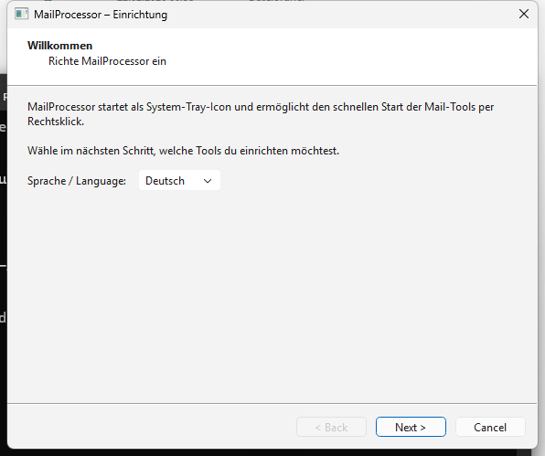

# MailProcessor

System tray launcher for the three Universal Mail Tools.

> **Deutsche Dokumentation:** [README-DE.md](README-DE.md)



## What it does

MailProcessor sits in the Windows system tray and gives you one-click access to:

- **Universal Mail Cleaner** — Clean an IMAP mailbox by rules
- **Universal Docs Grabber** — Download documents and attachments from mail
- **Universal Invoice Mail** — Extract invoices automatically from mail

## Features

- System tray icon: launch any tool via right-click at any time
- First run: setup wizard with automatic scan for installed tools
- GitHub installer: download tools directly from GitHub Releases
- Version numbers shown in tray menu (read from each tool's CHANGELOG.md)
- Settings: change paths, remove tools, add manually
- Windows autostart (registry entry)
- Bilingual: German / English

## Installation

1. Install Python 3.10+
2. Install dependencies:
   ```bash
   pip install -r requirements.txt
   ```
3. Launch:
   ```bash
   start.bat
   ```
   or
   ```bash
   python main.py
   ```
4. Select the desired tools in the setup wizard

## Requirements

- Python 3.10+
- PySide6 6.x
- One or more Universal Mail Tools (auto-downloaded via wizard)

## Configuration

Settings are stored in `%LOCALAPPDATA%\MailProcessor\config.json`.

Tools are installed to `%LOCALAPPDATA%\MailProcessor\tools\`.

## License

MIT License — see [LICENSE](LICENSE)
